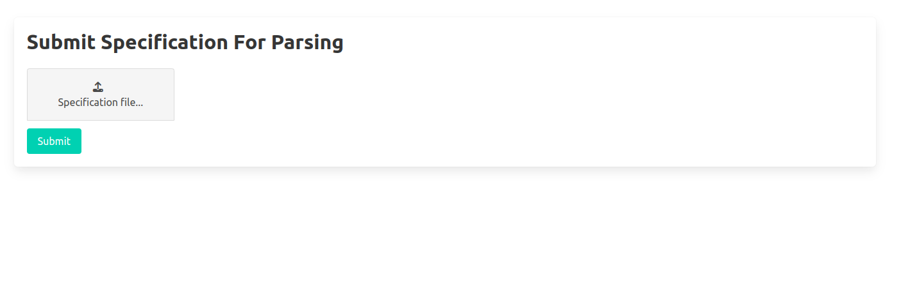
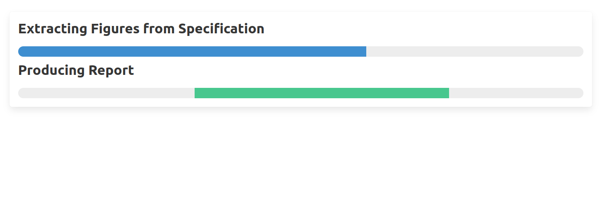
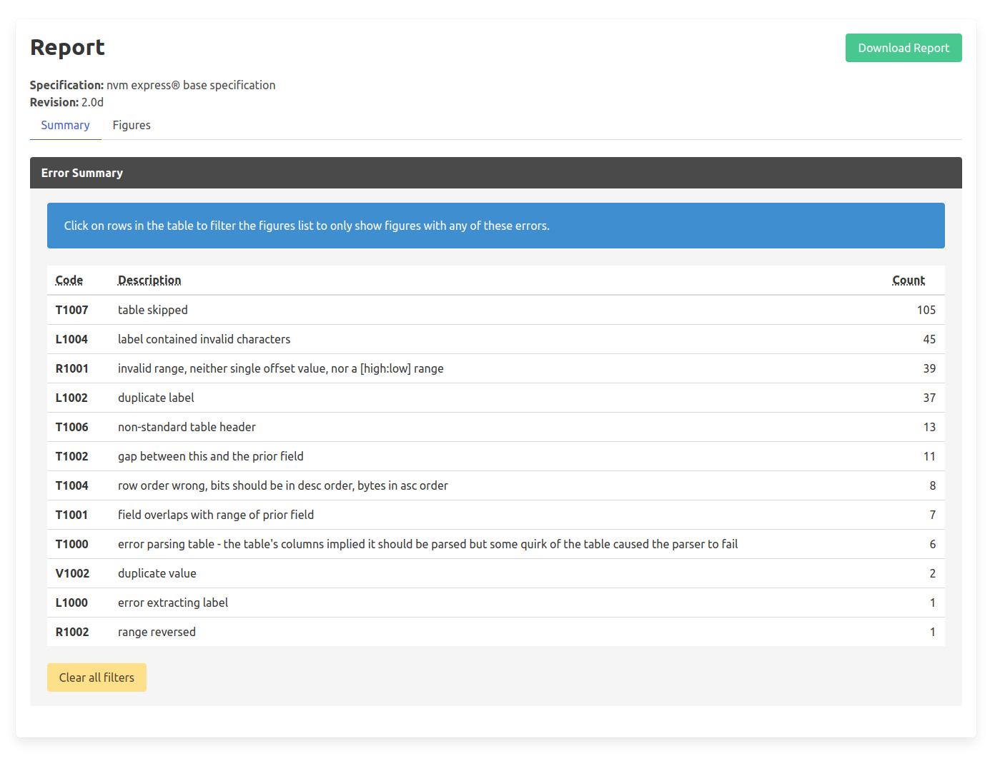

.. _sec-welcome:

Welcome to NVMe-Spex's documentation!
=====================================

.. toctree::
   :maxdepth: 1
   :hidden:

   what_is_spex.rst
   setup/index.rst
   user_guide/stages.rst
   user_guide/using_spex.rst
   user_guide/dev.rst

Welcome to the documentation for **Spex**, a tool for extracting information
on data-structures in the NVMe specification documents.

To read more about what **Spex** does, see :ref:`sec-what-is-spex`.
For help on setting up **Spex** on your system, see :ref:`sec-setup`.

For direct usage of nvme-spex as a linting tool it is possible to run it from
docker. For setup of docker on windows we refer to guides from `Docker Desktop
<https://docs.docker.com/desktop/install/windows-install/>`_ or `Podman
<https://podman.io/docs/installation>`_

.. code-block:: shell

       docker pull ghcr.io/samsungds/nvme-spex-webserver:latest
       docker run -p 8000:8000 ghcr.io/samsungds/nvme-spex-webserver:latest

When the docker container is successfully running the web application can be
accessed in the browser at `http://localhost:8000 <http://localhost:8000>`_.

The web application will show the following user interface:

Upload the specification .docx or .html file and press the submit button.

After processing is done the web-application will show
the following report:

